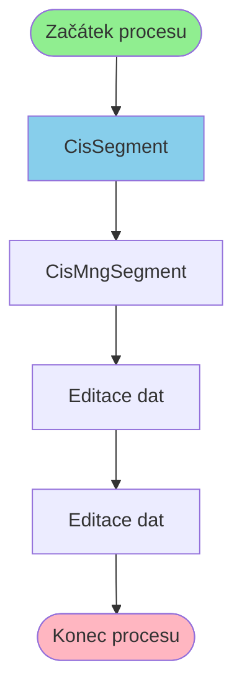

# Proces začínající v CisSegment

**Vstupní bod:** CisSegment

## Přehled procesu

Tento business proces začíná na stránce **CisSegment** a pokračuje přes 3 dalších kroků.

## Business Process Flow

## Kroky procesu

### Krok 1: CisSegment

- **Stránka:** `CisSegment`
- **Typ:** Vstupní bod procesu

### Krok 2: CisMngSegment

- **Stránka:** `CisMngSegment`
- **Typ:** Procesní krok

### Krok 3: Editace dat

- **Stránka:** `CisMngSegmentEdit`
- **Typ:** Procesní krok

### Krok 4: Editace dat

- **Stránka:** `CisMngSegmentEditProcess`
- **Typ:** Konečný krok

