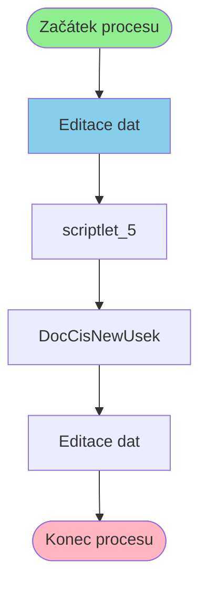

# Proces: DocCisNewUsekEditProcess

**Vstupní bod:** DocCisNewUsekEditProcess

## Přehled procesu

Tento business proces začíná na stránce **DocCisNewUsekEditProcess** a pokračuje přes 3 dalších kroků.

## Business Process Flow

## Kroky procesu

### Krok 1: Editace dat

- **Stránka:** `DocCisNewUsekEditProcess`
- **Typ:** Vstupní bod procesu

### Krok 2: scriptlet_5

- **Stránka:** `scriptlet_5`
- **Typ:** Procesní krok

### Krok 3: DocCisNewUsek

- **Stránka:** `DocCisNewUsek`
- **Typ:** Procesní krok

### Krok 4: Editace dat

- **Stránka:** `DocCisNewUsekEdit`
- **Typ:** Konečný krok

