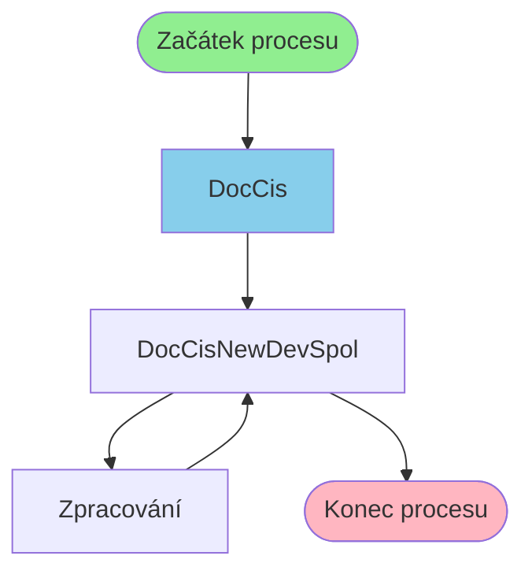

# Proces začínající v DocCis

**Vstupní bod:** DocCis

## Přehled procesu

Tento business proces začíná na stránce **DocCis** a pokračuje přes 2 dalších kroků.

## Business Process Flow

## Kroky procesu

### Krok 1: DocCis

- **Stránka:** `DocCis`
- **Typ:** Vstupní bod procesu

### Krok 2: DocCisNewDevSpol

- **Stránka:** `DocCisNewDevSpol`
- **Typ:** Procesní krok

### Krok 3: Zpracování

- **Stránka:** `DocCisNewDevSpolProcess`
- **Typ:** Procesní krok

### Krok 4: DocCisNewDevSpol

- **Stránka:** `DocCisNewDevSpol`
- **Typ:** Konečný krok

## Alternativní flow

Proces má 2 různých variant flow:

1. DocCis → DocCisNewDevSpol → Zpracování → DocCisNewDevSpol
2. DocCis → DocCisNewDevSpol → Zpracování
