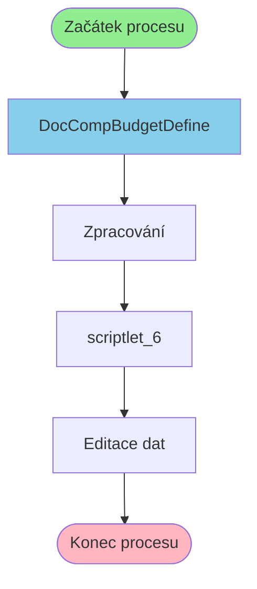

# Proces začínající v DocCompBudgetDefine

**Vstupní bod:** DocCompBudgetDefine

## Přehled procesu

Tento business proces začíná na stránce **DocCompBudgetDefine** a pokračuje přes 3 dalších kroků.

## Business Process Flow

## Kroky procesu

### Krok 1: DocCompBudgetDefine

- **Stránka:** `DocCompBudgetDefine`
- **Typ:** Vstupní bod procesu

### Krok 2: Zpracování

- **Stránka:** `DocCompBudgetDefineProcess`
- **Typ:** Procesní krok

### Krok 3: scriptlet_6

- **Stránka:** `scriptlet_6`
- **Typ:** Procesní krok

### Krok 4: Editace dat

- **Stránka:** `DocCompBudgetEdit`
- **Typ:** Konečný krok

