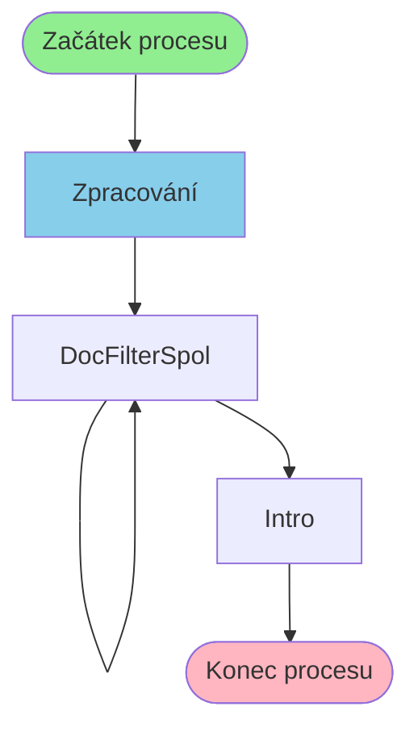

# Proces: DocFilterSpolProcess

**Vstupní bod:** DocFilterSpolProcess

## Přehled procesu

Tento business proces začíná na stránce **DocFilterSpolProcess** a pokračuje přes 2 dalších kroků.

## Business Process Flow

## Kroky procesu

### Krok 1: Zpracování

- **Stránka:** `DocFilterSpolProcess`
- **Typ:** Vstupní bod procesu

### Krok 2: DocFilterSpol

- **Stránka:** `DocFilterSpol`
- **Typ:** Procesní krok

### Krok 3: DocFilterSpol

- **Stránka:** `DocFilterSpol`
- **Typ:** Procesní krok

### Krok 4: Intro

- **Stránka:** `Intro`
- **Typ:** Konečný krok

## Alternativní flow

Proces má 3 různých variant flow:

1. Zpracování → DocFilterSpol → DocFilterSpol → Intro
2. Zpracování → DocFilterSpol → DocFilterSpol
3. Zpracování → DocFilterSpol → Intro
