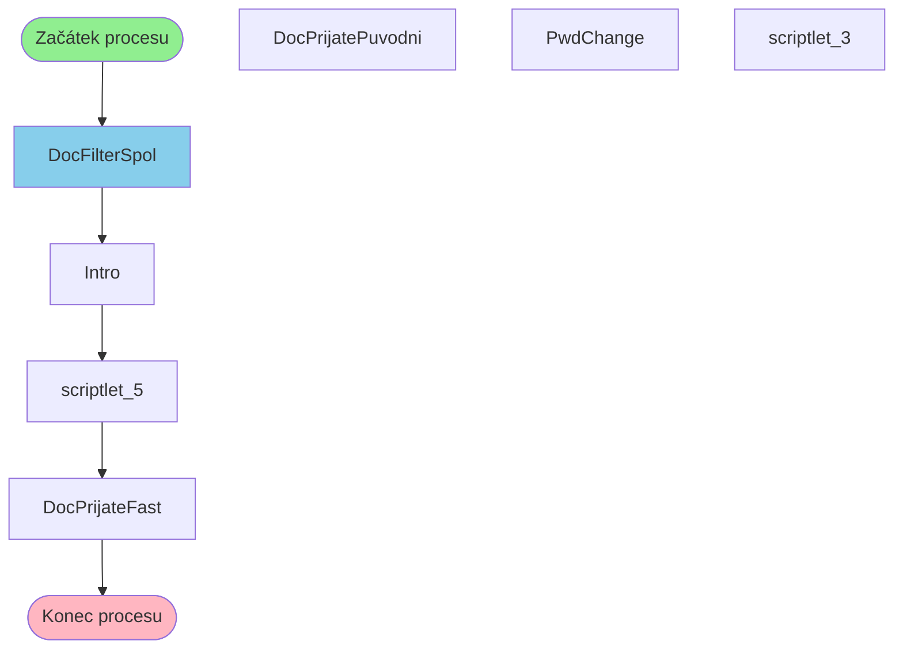

# Proces začínající v DocFilterSpol

**Vstupní bod:** DocFilterSpol

## Přehled procesu

Tento business proces začíná na stránce **DocFilterSpol** a pokračuje přes 6 dalších kroků.

## Business Process Flow

## Kroky procesu

### Krok 1: DocFilterSpol

- **Stránka:** `DocFilterSpol`
- **Typ:** Vstupní bod procesu

### Krok 2: Intro

- **Stránka:** `Intro`
- **Typ:** Procesní krok

### Krok 3: scriptlet_5

- **Stránka:** `scriptlet_5`
- **Typ:** Procesní krok

### Krok 4: DocPrijateFast

- **Stránka:** `DocPrijateFast`
- **Typ:** Konečný krok

## Alternativní flow

Proces má 4 různých variant flow:

1. DocFilterSpol → Intro → scriptlet_5 → DocPrijateFast
2. DocFilterSpol → Intro → scriptlet_5 → DocPrijatePuvodni
3. DocFilterSpol → Intro → scriptlet_5 → PwdChange
4. DocFilterSpol → DocFilterSpol → scriptlet_3 → Intro
