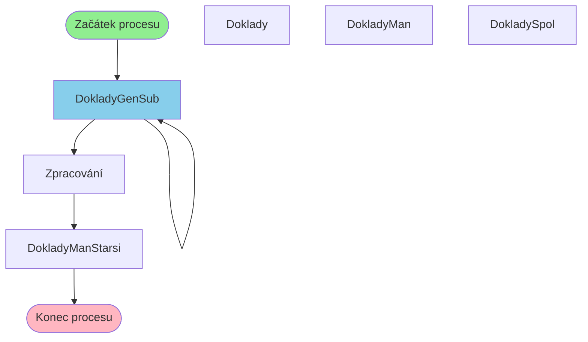

# Proces začínající v DokladyGenSub

**Vstupní bod:** DokladyGenSub

## Přehled procesu

Tento business proces začíná na stránce **DokladyGenSub** a pokračuje přes 5 dalších kroků.

## Business Process Flow

## Kroky procesu

### Krok 1: DokladyGenSub

- **Stránka:** `DokladyGenSub`
- **Typ:** Vstupní bod procesu

### Krok 2: DokladyGenSub

- **Stránka:** `DokladyGenSub`
- **Typ:** Procesní krok

### Krok 3: Zpracování

- **Stránka:** `DokladyProcessGen`
- **Typ:** Procesní krok

### Krok 4: DokladyManStarsi

- **Stránka:** `DokladyManStarsi`
- **Typ:** Konečný krok

## Alternativní flow

Proces má 9 různých variant flow:

1. DokladyGenSub → DokladyGenSub → Zpracování → DokladyManStarsi
2. DokladyGenSub → DokladyGenSub → Zpracování → DokladyMan
3. DokladyGenSub → Zpracování → Zpracování → DokladyManStarsi
4. DokladyGenSub → Zpracování → Zpracování → DokladySpol
5. DokladyGenSub → DokladyGenSub → Zpracování → Zpracování

... a dalších 4 variant
