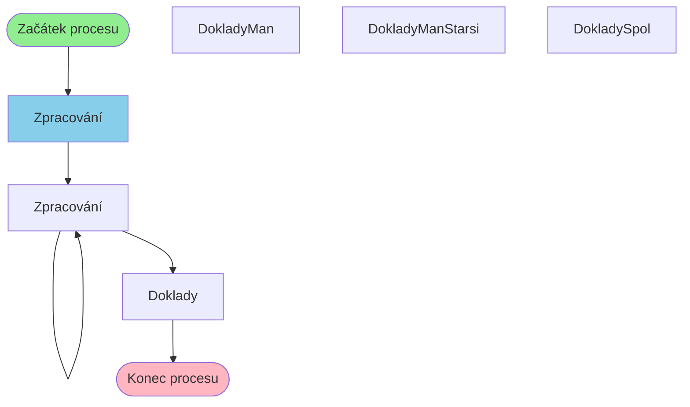

# Proces: DokladySubKonProcess

**Vstupní bod:** DokladySubKonProcess

## Přehled procesu

Tento business proces začíná na stránce **DokladySubKonProcess** a pokračuje přes 5 dalších kroků.

## Business Process Flow

## Kroky procesu

### Krok 1: Zpracování

- **Stránka:** `DokladySubKonProcess`
- **Typ:** Vstupní bod procesu

### Krok 2: Zpracování

- **Stránka:** `DokladyProcessGen`
- **Typ:** Procesní krok

### Krok 3: Zpracování

- **Stránka:** `DokladyProcessGen`
- **Typ:** Procesní krok

### Krok 4: Doklady

- **Stránka:** `Doklady`
- **Typ:** Konečný krok

## Alternativní flow

Proces má 4 různých variant flow:

1. Zpracování → Zpracování → Zpracování → Doklady
2. Zpracování → Zpracování → Zpracování → DokladyManStarsi
3. Zpracování → Zpracování → Zpracování → DokladyMan
4. Zpracování → Zpracování → Zpracování → DokladySpol
