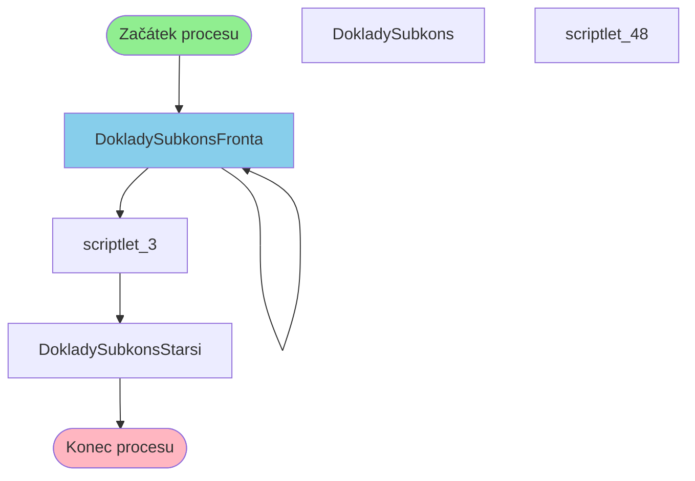

# Proces začínající v DokladySubkonsFronta

**Vstupní bod:** DokladySubkonsFronta

## Přehled procesu

Tento business proces začíná na stránce **DokladySubkonsFronta** a pokračuje přes 4 dalších kroků.

## Business Process Flow

## Kroky procesu

### Krok 1: DokladySubkonsFronta

- **Stránka:** `DokladySubkonsFronta`
- **Typ:** Vstupní bod procesu

### Krok 2: DokladySubkonsFronta

- **Stránka:** `DokladySubkonsFronta`
- **Typ:** Procesní krok

### Krok 3: scriptlet_3

- **Stránka:** `scriptlet_3`
- **Typ:** Procesní krok

### Krok 4: DokladySubkonsStarsi

- **Stránka:** `DokladySubkonsStarsi`
- **Typ:** Konečný krok

## Alternativní flow

Proces má 5 různých variant flow:

1. DokladySubkonsFronta → DokladySubkonsFronta → scriptlet_3 → DokladySubkonsStarsi
2. DokladySubkonsFronta → scriptlet_3 → DokladySubkonsFronta → DokladySubkons
3. DokladySubkonsFronta → scriptlet_3 → DokladySubkonsFronta → DokladySubkonsStarsi
4. DokladySubkonsFronta → DokladySubkonsFronta → scriptlet_3 → DokladySubkons
5. DokladySubkonsFronta → DokladySubkons → scriptlet_48 → DokladySubkons
