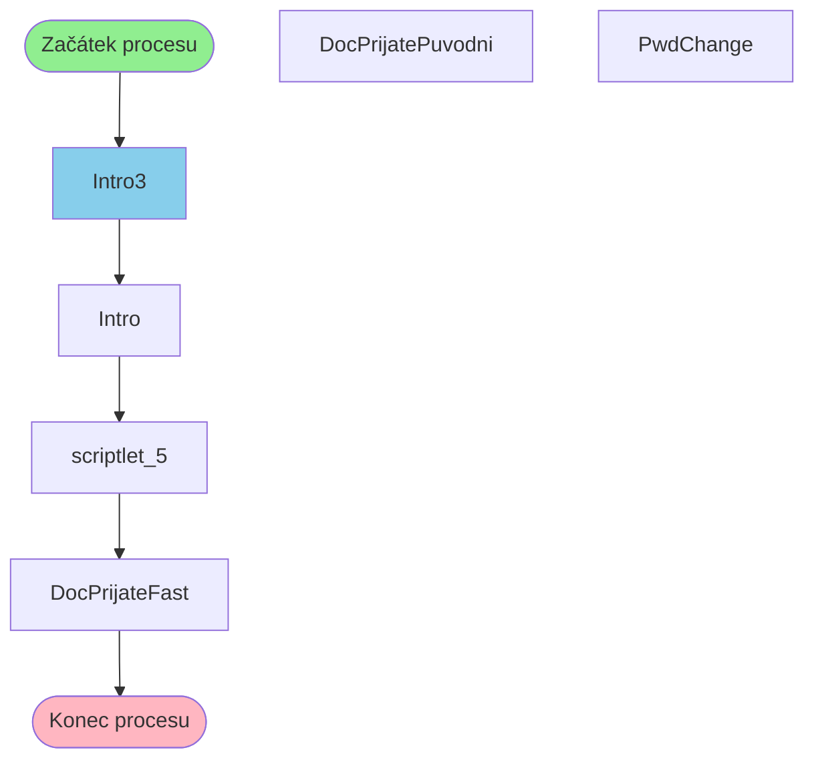

# Proces začínající v Intro3

**Vstupní bod:** Intro3

## Přehled procesu

Tento business proces začíná na stránce **Intro3** a pokračuje přes 5 dalších kroků.

## Business Process Flow

## Kroky procesu

### Krok 1: Intro3

- **Stránka:** `Intro3`
- **Typ:** Vstupní bod procesu

### Krok 2: Intro

- **Stránka:** `Intro`
- **Typ:** Procesní krok

### Krok 3: scriptlet_5

- **Stránka:** `scriptlet_5`
- **Typ:** Procesní krok

### Krok 4: DocPrijateFast

- **Stránka:** `DocPrijateFast`
- **Typ:** Konečný krok

## Alternativní flow

Proces má 3 různých variant flow:

1. Intro3 → Intro → scriptlet_5 → DocPrijateFast
2. Intro3 → Intro → scriptlet_5 → PwdChange
3. Intro3 → Intro → scriptlet_5 → DocPrijatePuvodni
