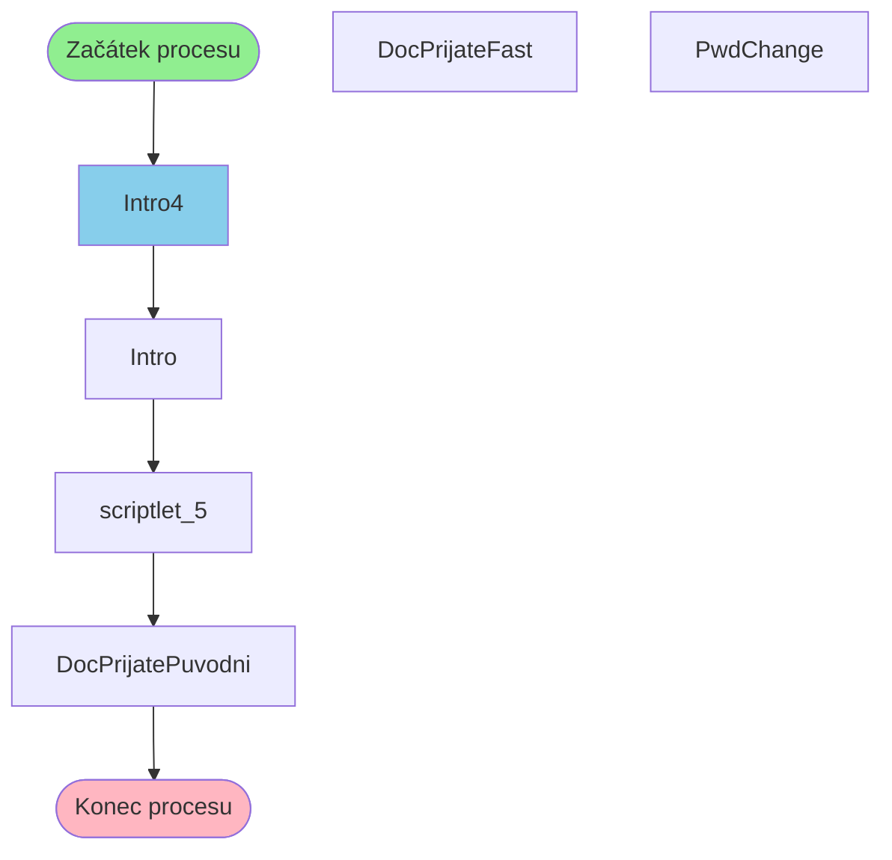

# Proces začínající v Intro4

**Vstupní bod:** Intro4

## Přehled procesu

Tento business proces začíná na stránce **Intro4** a pokračuje přes 5 dalších kroků.

## Business Process Flow

## Kroky procesu

### Krok 1: Intro4

- **Stránka:** `Intro4`
- **Typ:** Vstupní bod procesu

### Krok 2: Intro

- **Stránka:** `Intro`
- **Typ:** Procesní krok

### Krok 3: scriptlet_5

- **Stránka:** `scriptlet_5`
- **Typ:** Procesní krok

### Krok 4: DocPrijatePuvodni

- **Stránka:** `DocPrijatePuvodni`
- **Typ:** Konečný krok

## Alternativní flow

Proces má 3 různých variant flow:

1. Intro4 → Intro → scriptlet_5 → DocPrijatePuvodni
2. Intro4 → Intro → scriptlet_5 → PwdChange
3. Intro4 → Intro → scriptlet_5 → DocPrijateFast
