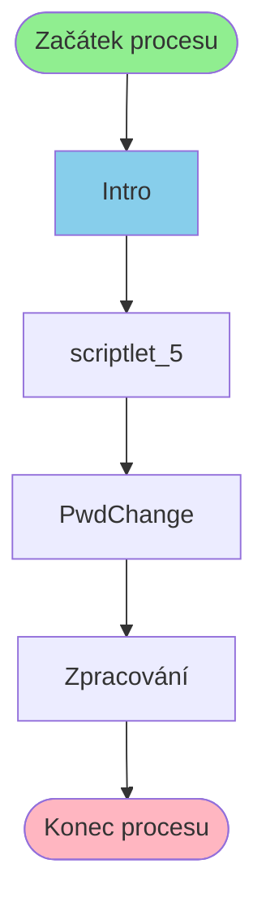

# Proces začínající v Intro

**Vstupní bod:** Intro

## Přehled procesu

Tento business proces začíná na stránce **Intro** a pokračuje přes 3 dalších kroků.

## Business Process Flow

## Kroky procesu

### Krok 1: Intro

- **Stránka:** `Intro`
- **Typ:** Vstupní bod procesu

### Krok 2: scriptlet_5

- **Stránka:** `scriptlet_5`
- **Typ:** Procesní krok

### Krok 3: PwdChange

- **Stránka:** `PwdChange`
- **Typ:** Procesní krok

### Krok 4: Zpracování

- **Stránka:** `PwdChangeProcess`
- **Typ:** Konečný krok

