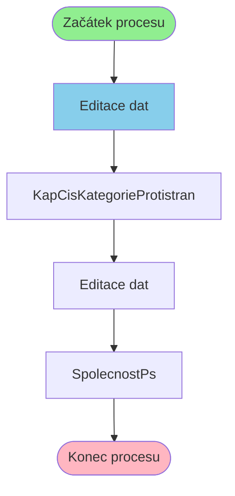

# Proces: KapCisKategorieProtistranEditProcess

**Vstupní bod:** KapCisKategorieProtistranEditProcess

## Přehled procesu

Tento business proces začíná na stránce **KapCisKategorieProtistranEditProcess** a pokračuje přes 3 dalších kroků.

## Business Process Flow

## Kroky procesu

### Krok 1: Editace dat

- **Stránka:** `KapCisKategorieProtistranEditProcess`
- **Typ:** Vstupní bod procesu

### Krok 2: KapCisKategorieProtistran

- **Stránka:** `KapCisKategorieProtistran`
- **Typ:** Procesní krok

### Krok 3: Editace dat

- **Stránka:** `KapCisKategorieProtistranEdit`
- **Typ:** Procesní krok

### Krok 4: SpolecnostPs

- **Stránka:** `SpolecnostPs`
- **Typ:** Konečný krok

