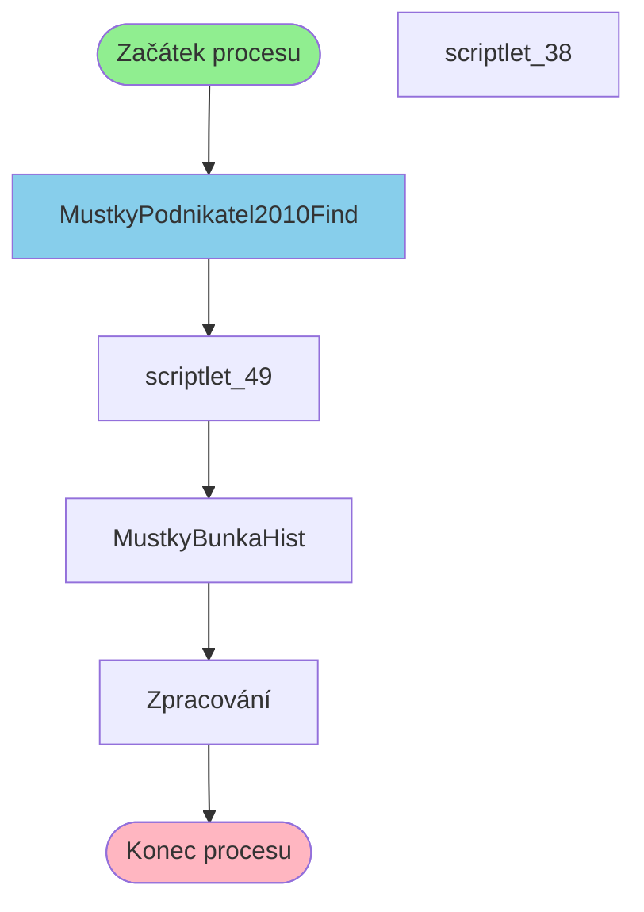

# Proces začínající v MustkyPodnikatel2010Find

**Vstupní bod:** MustkyPodnikatel2010Find

## Přehled procesu

Tento business proces začíná na stránce **MustkyPodnikatel2010Find** a pokračuje přes 4 dalších kroků.

## Business Process Flow

## Kroky procesu

### Krok 1: MustkyPodnikatel2010Find

- **Stránka:** `MustkyPodnikatel2010Find`
- **Typ:** Vstupní bod procesu

### Krok 2: scriptlet_49

- **Stránka:** `scriptlet_49`
- **Typ:** Procesní krok

### Krok 3: MustkyBunkaHist

- **Stránka:** `MustkyBunkaHist`
- **Typ:** Procesní krok

### Krok 4: Zpracování

- **Stránka:** `MustkyBunkaHistProcess`
- **Typ:** Konečný krok

## Alternativní flow

Proces má 2 různých variant flow:

1. MustkyPodnikatel2010Find → scriptlet_49 → MustkyBunkaHist → Zpracování
2. MustkyPodnikatel2010Find → scriptlet_38 → MustkyBunkaHist → Zpracování
