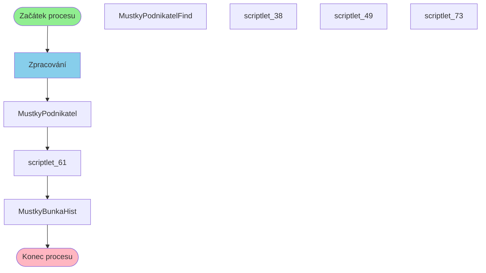

# Proces: MustkyPodnikatelProcess

**Vstupní bod:** MustkyPodnikatelProcess

## Přehled procesu

Tento business proces začíná na stránce **MustkyPodnikatelProcess** a pokračuje přes 7 dalších kroků.

## Business Process Flow

## Kroky procesu

### Krok 1: Zpracování

- **Stránka:** `MustkyPodnikatelProcess`
- **Typ:** Vstupní bod procesu

### Krok 2: MustkyPodnikatel

- **Stránka:** `MustkyPodnikatel`
- **Typ:** Procesní krok

### Krok 3: scriptlet_61

- **Stránka:** `scriptlet_61`
- **Typ:** Procesní krok

### Krok 4: MustkyBunkaHist

- **Stránka:** `MustkyBunkaHist`
- **Typ:** Konečný krok

## Alternativní flow

Proces má 4 různých variant flow:

1. Zpracování → MustkyPodnikatel → scriptlet_61 → MustkyBunkaHist
2. Zpracování → MustkyPodnikatelFind → scriptlet_49 → MustkyBunkaHist
3. Zpracování → MustkyPodnikatelFind → scriptlet_38 → MustkyBunkaHist
4. Zpracování → MustkyPodnikatel → scriptlet_73 → MustkyBunkaHist
