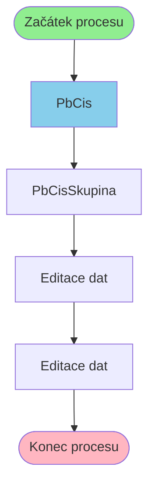

# Proces začínající v PbCis

**Vstupní bod:** PbCis

## Přehled procesu

Tento business proces začíná na stránce **PbCis** a pokračuje přes 3 dalších kroků.

## Business Process Flow

## Kroky procesu

### Krok 1: PbCis

- **Stránka:** `PbCis`
- **Typ:** Vstupní bod procesu

### Krok 2: PbCisSkupina

- **Stránka:** `PbCisSkupina`
- **Typ:** Procesní krok

### Krok 3: Editace dat

- **Stránka:** `PbCisSkupinaEdit`
- **Typ:** Procesní krok

### Krok 4: Editace dat

- **Stránka:** `PbCisSkupinaEditProcess`
- **Typ:** Konečný krok

