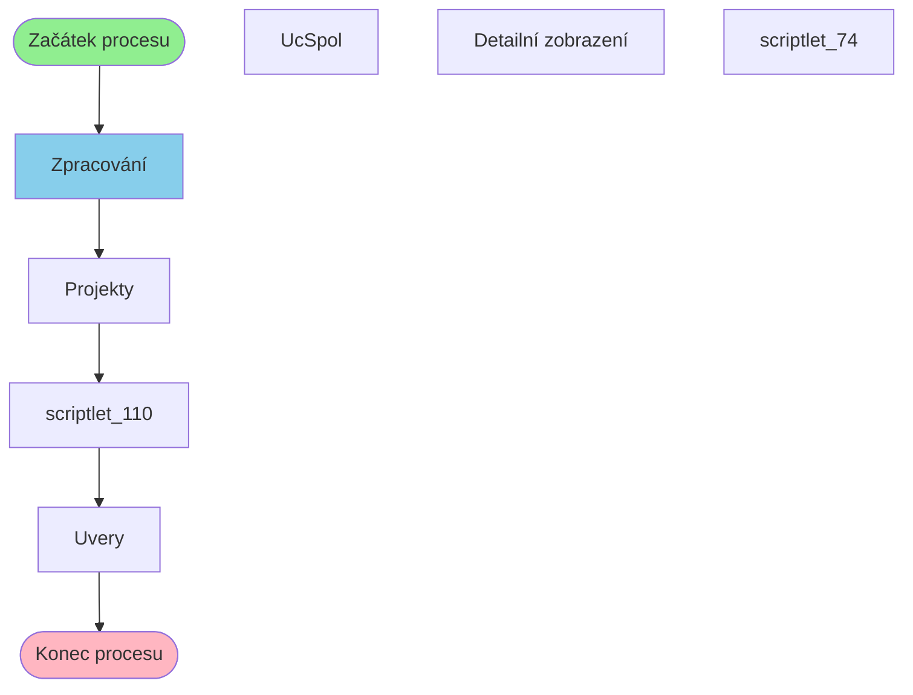

# Proces: ProjektTransakceAllExcelProcess

**Vstupní bod:** ProjektTransakceAllExcelProcess

## Přehled procesu

Tento business proces začíná na stránce **ProjektTransakceAllExcelProcess** a pokračuje přes 6 dalších kroků.

## Business Process Flow

## Kroky procesu

### Krok 1: Zpracování

- **Stránka:** `ProjektTransakceAllExcelProcess`
- **Typ:** Vstupní bod procesu

### Krok 2: Projekty

- **Stránka:** `Projekty`
- **Typ:** Procesní krok

### Krok 3: scriptlet_110

- **Stránka:** `scriptlet_110`
- **Typ:** Procesní krok

### Krok 4: Uvery

- **Stránka:** `Uvery`
- **Typ:** Konečný krok

## Alternativní flow

Proces má 4 různých variant flow:

1. Zpracování → Projekty → scriptlet_110 → Uvery
2. Zpracování → Projekty → scriptlet_110 → Detailní zobrazení
3. Zpracování → Projekty → scriptlet_110 → Uvery
4. Zpracování → Projekty → scriptlet_74 → UcSpol
