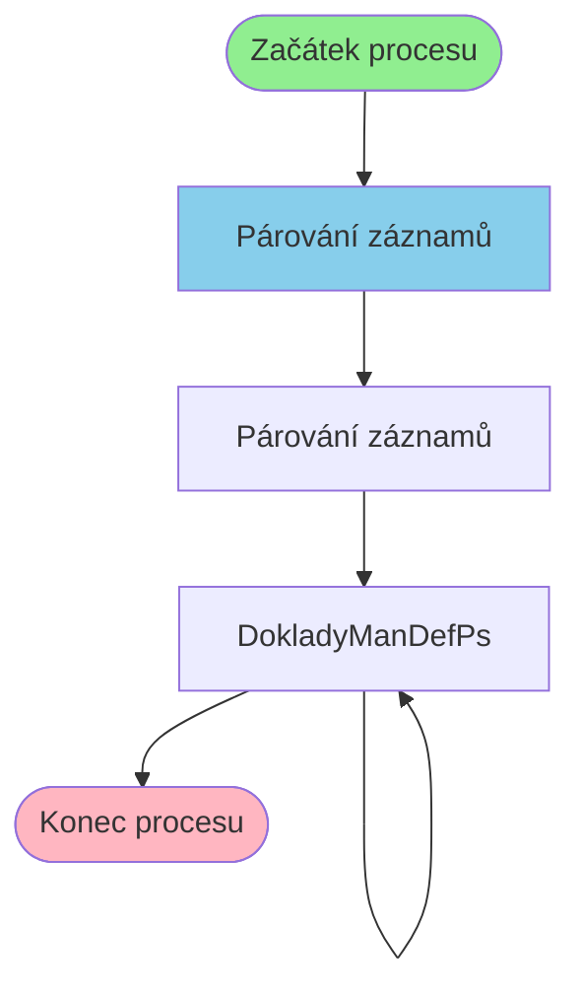

# Proces: ProtiPoziceParovaniProcess

**Vstupní bod:** ProtiPoziceParovaniProcess

## Přehled procesu

Tento business proces začíná na stránce **ProtiPoziceParovaniProcess** a pokračuje přes 2 dalších kroků.

## Business Process Flow

## Kroky procesu

### Krok 1: Párování záznamů

- **Stránka:** `ProtiPoziceParovaniProcess`
- **Typ:** Vstupní bod procesu

### Krok 2: Párování záznamů

- **Stránka:** `ProtiPoziceParovani`
- **Typ:** Procesní krok

### Krok 3: DokladyManDefPs

- **Stránka:** `DokladyManDefPs`
- **Typ:** Procesní krok

### Krok 4: DokladyManDefPs

- **Stránka:** `DokladyManDefPs`
- **Typ:** Konečný krok

