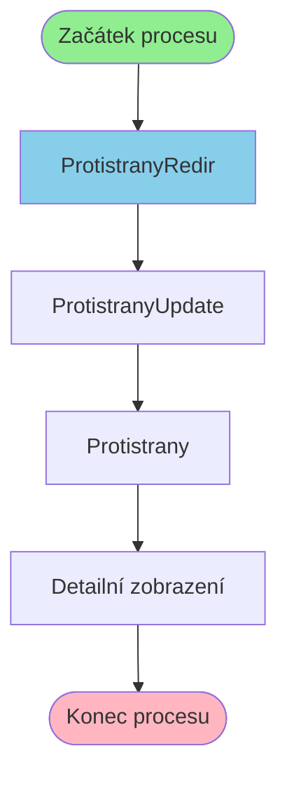

# Proces začínající v ProtistranyRedir

**Vstupní bod:** ProtistranyRedir

## Přehled procesu

Tento business proces začíná na stránce **ProtistranyRedir** a pokračuje přes 3 dalších kroků.

## Business Process Flow

## Kroky procesu

### Krok 1: ProtistranyRedir

- **Stránka:** `ProtistranyRedir`
- **Typ:** Vstupní bod procesu

### Krok 2: ProtistranyUpdate

- **Stránka:** `ProtistranyUpdate`
- **Typ:** Procesní krok

### Krok 3: Protistrany

- **Stránka:** `Protistrany`
- **Typ:** Procesní krok

### Krok 4: Detailní zobrazení

- **Stránka:** `ProtistranyDetailHist`
- **Typ:** Konečný krok

