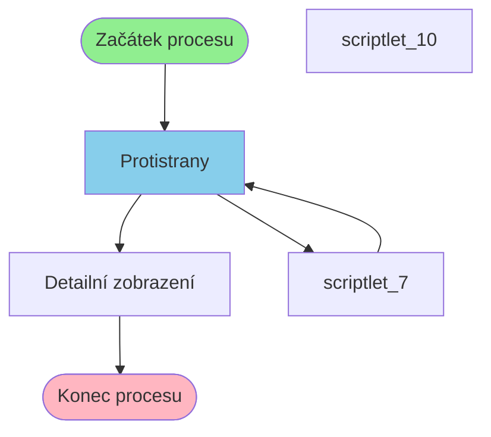

# Proces začínající v Protistrany

**Vstupní bod:** Protistrany

## Přehled procesu

Tento business proces začíná na stránce **Protistrany** a pokračuje přes 3 dalších kroků.

## Business Process Flow

## Kroky procesu

### Krok 1: Protistrany

- **Stránka:** `Protistrany`
- **Typ:** Vstupní bod procesu

### Krok 2: scriptlet_7

- **Stránka:** `scriptlet_7`
- **Typ:** Procesní krok

### Krok 3: Protistrany

- **Stránka:** `Protistrany`
- **Typ:** Procesní krok

### Krok 4: Detailní zobrazení

- **Stránka:** `ProtistranyDetailHist`
- **Typ:** Konečný krok

## Alternativní flow

Proces má 2 různých variant flow:

1. Protistrany → scriptlet_7 → Protistrany → Detailní zobrazení
2. Protistrany → scriptlet_10 → Protistrany → Detailní zobrazení
