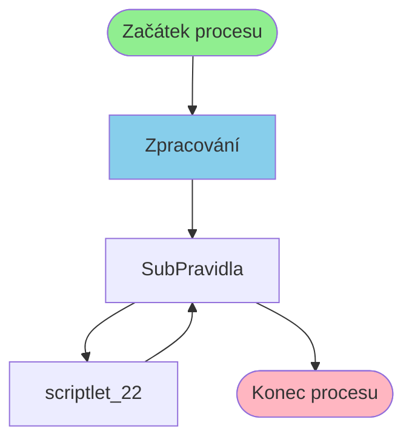

# Proces: SubPravidlaProcess

**Vstupní bod:** SubPravidlaProcess

## Přehled procesu

Tento business proces začíná na stránce **SubPravidlaProcess** a pokračuje přes 2 dalších kroků.

## Business Process Flow

## Kroky procesu

### Krok 1: Zpracování

- **Stránka:** `SubPravidlaProcess`
- **Typ:** Vstupní bod procesu

### Krok 2: SubPravidla

- **Stránka:** `SubPravidla`
- **Typ:** Procesní krok

### Krok 3: scriptlet_22

- **Stránka:** `scriptlet_22`
- **Typ:** Procesní krok

### Krok 4: SubPravidla

- **Stránka:** `SubPravidla`
- **Typ:** Konečný krok

