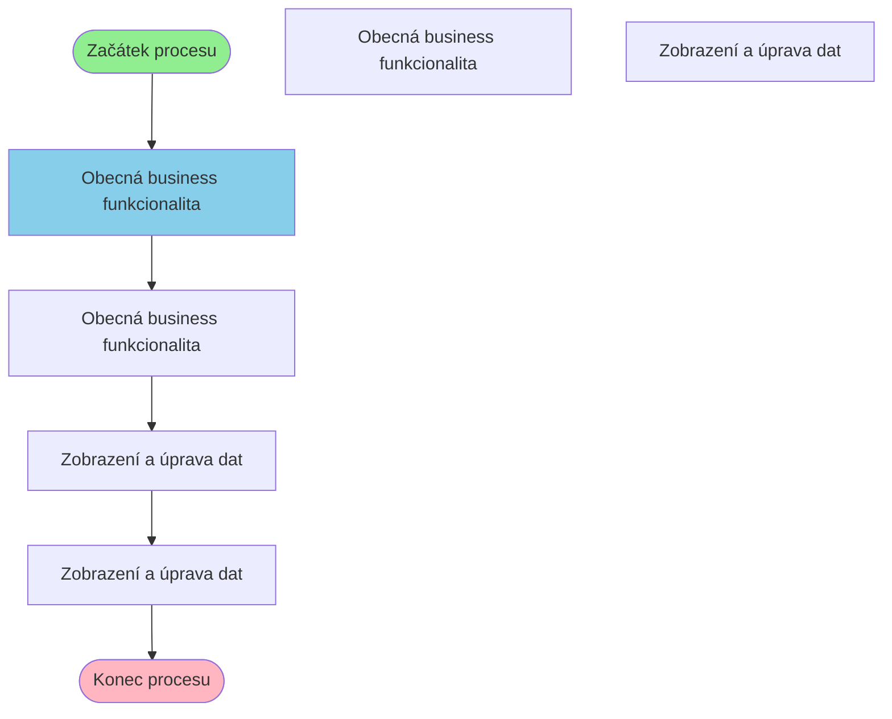

# Business proces: CisSegment

**Vstupní stránka:** CisSegment

## Přehled procesu

**Počet kroků:** 6
**Počet variant flow:** 3

## Procesní diagram

## Detailní analýza kroků

### Krok 1: CisSegment

**Soubor:** `/Users/radektuma/DEV/KIS/sources/JSP/CisSegment.jsp`

**Funkce v procesu:** Obecná business funkcionalita

#### Volané Java metody

- `Navigator.getInstance()`
- `reload()`
- `set()`

---

### Krok 2: CisMngSegment

**Soubor:** `/Users/radektuma/DEV/KIS/sources/JSP/CisMngSegment.jsp`

**Funkce v procesu:** Obecná business funkcionalita

#### Volané Java metody

- `decode()`
- `deleteId()`
- `getElementById()`
- `submitId()`

#### Business pravidla

- Import dat z externích zdrojů

---

### Krok 3: CisMngSegmentEdit

**Soubor:** `/Users/radektuma/DEV/KIS/sources/JSP/CisMngSegmentEdit.jsp`

**Funkce v procesu:** Zobrazení a úprava dat

#### Volané Java metody

- `HtmlServices.getRequestParameters()`
- `Integer.parseInt()`
- `getAttribute()`
- `getParameter()`
- `if()`

#### Business pravidla

- Import dat z externích zdrojů

---

### Krok 4: CisMngSegmentEditProcess

**Soubor:** `/Users/radektuma/DEV/KIS/sources/JSP/CisMngSegmentEditProcess.jsp`

**Funkce v procesu:** Zobrazení a úprava dat

#### Volané Java metody

- `HtmlServices.getRequestParameters()`
- `IfrsModule.useApplicationModule()`
- `Integer.parseInt()`
- `equalsIgnoreCase()`
- `getParameter()`

#### Business pravidla

- Import dat z externích zdrojů

---

## Alternativní procesní cesty

1. CisSegment → CisMngSegment → CisMngSegmentEdit → CisMngSegmentEditProcess
2. CisSegment → CisMngSegment → CisMngSegmentEdit
3. CisSegment → CisMngSegmentBoss → CisMngSegmentBossEdit
