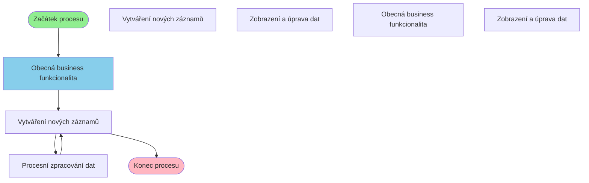

# Business proces: DocCis

**Vstupní stránka:** DocCis

## Přehled procesu

**Počet kroků:** 7
**Počet variant flow:** 3

## Procesní diagram

## Detailní analýza kroků

### Krok 1: DocCis

**Soubor:** `/Users/radektuma/DEV/KIS/sources/JSP/DocCis.jsp`

**Funkce v procesu:** Obecná business funkcionalita

#### Volané Java metody

- `Navigator.getInstance()`
- `reload()`
- `set()`

---

### Krok 2: DocCisNewDevSpol

**Soubor:** `/Users/radektuma/DEV/KIS/sources/JSP/DocCisNewDevSpol.jsp`

**Funkce v procesu:** Vytváření nových záznamů

#### Databázové operace

- **KP_DEF_DEVELOPERSPOLECNOST**: SELECT
  - Sloupce: NULL

#### Business pravidla

- Import dat z externích zdrojů

---

### Krok 3: DocCisNewDevSpolProcess

**Soubor:** `/Users/radektuma/DEV/KIS/sources/JSP/DocCisNewDevSpolProcess.jsp`

**Funkce v procesu:** Procesní zpracování dat

#### Volané Java metody

- `DokumentModule.useApplicationModule()`
- `HtmlServices.getRequestParameters()`
- `Integer.parseInt()`
- `defDeveloper()`
- `getParameter()`

#### Business pravidla

- Import dat z externích zdrojů

---

### Krok 4: DocCisNewDevSpol

**Soubor:** `/Users/radektuma/DEV/KIS/sources/JSP/DocCisNewDevSpol.jsp`

**Funkce v procesu:** Vytváření nových záznamů

#### Databázové operace

- **KP_DEF_DEVELOPERSPOLECNOST**: SELECT
  - Sloupce: NULL

#### Business pravidla

- Import dat z externích zdrojů

---

## Alternativní procesní cesty

1. DocCis → DocCisNewDevSpol → DocCisNewDevSpolProcess → DocCisNewDevSpol
2. DocCis → DocCisStatus → DocCisStatusEdit
3. DocCis → DocCisNewUsek → DocCisNewUsekEdit
