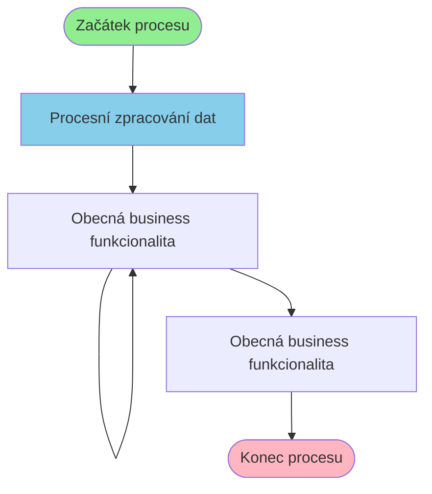

# Business proces: DocFilterSpolProcess

**Vstupní stránka:** DocFilterSpolProcess

## Přehled procesu

**Počet kroků:** 3
**Počet variant flow:** 1

## Procesní diagram

## Detailní analýza kroků

### Krok 1: DocFilterSpolProcess

**Soubor:** `/Users/radektuma/DEV/KIS/sources/JSP/DocFilterSpolProcess.jsp`

**Funkce v procesu:** Procesní zpracování dat

#### Volané Java metody

- `DokumentModule.useApplicationModule()`
- `HtmlServices.getRequestParameters()`
- `Integer.parseInt()`
- `getParameter()`
- `length()`

#### Business pravidla

- Import dat z externích zdrojů

---

### Krok 2: DocFilterSpol

**Soubor:** `/Users/radektuma/DEV/KIS/sources/JSP/DocFilterSpol.jsp`

**Funkce v procesu:** Obecná business funkcionalita

#### Volané Java metody

- `DokumentModule.useApplicationModule()`
- `HtmlServices.getRequestParameters()`
- `Integer.parseInt()`
- `getAttribute()`
- `getParameter()`

#### Business pravidla

- Kontrola oprávnění uživatele
- Import dat z externích zdrojů

---

### Krok 3: DocFilterSpol

**Soubor:** `/Users/radektuma/DEV/KIS/sources/JSP/DocFilterSpol.jsp`

**Funkce v procesu:** Obecná business funkcionalita

#### Volané Java metody

- `DokumentModule.useApplicationModule()`
- `HtmlServices.getRequestParameters()`
- `Integer.parseInt()`
- `getAttribute()`
- `getParameter()`

#### Business pravidla

- Kontrola oprávnění uživatele
- Import dat z externích zdrojů

---

### Krok 4: Intro

**Soubor:** `/Users/radektuma/DEV/KIS/sources/JSP/Intro.jsp`

**Funkce v procesu:** Obecná business funkcionalita

#### Volané Java metody

- `Navigator.getInstance()`
- `SystemStatus.getInstance()`
- `getName()`
- `getStatus()`
- `getUserPrincipal()`

#### Business pravidla

- Kontrola oprávnění uživatele

---

