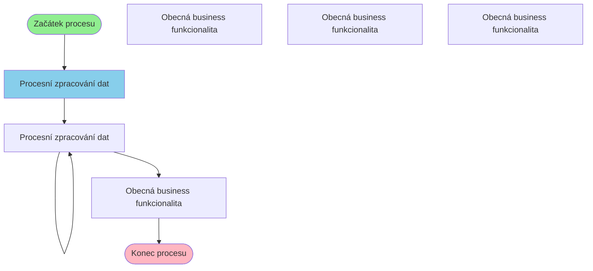

# Business proces: DokladyManDefProcess

**Vstupní stránka:** DokladyManDefProcess

## Přehled procesu

**Počet kroků:** 6
**Počet variant flow:** 4

## Procesní diagram

## Detailní analýza kroků

### Krok 1: DokladyManDefProcess

**Soubor:** `/Users/radektuma/DEV/KIS/sources/JSP/DokladyManDefProcess.jsp`

**Funkce v procesu:** Procesní zpracování dat

#### Volané Java metody

- `HtmlServices.getRequestParameters()`
- `Integer.parseInt()`
- `getParameter()`

#### Business pravidla

- Import dat z externích zdrojů

---

### Krok 2: DokladyProcessGen

**Soubor:** `/Users/radektuma/DEV/KIS/sources/JSP/DokladyProcessGen.jsp`

**Funkce v procesu:** Procesní zpracování dat

#### Volané Java metody

- `HtmlServices.getRequestParameters()`
- `Integer.parseInt()`
- `getParameter()`

#### Business pravidla

- Import dat z externích zdrojů

---

### Krok 3: DokladyProcessGen

**Soubor:** `/Users/radektuma/DEV/KIS/sources/JSP/DokladyProcessGen.jsp`

**Funkce v procesu:** Procesní zpracování dat

#### Volané Java metody

- `HtmlServices.getRequestParameters()`
- `Integer.parseInt()`
- `getParameter()`

#### Business pravidla

- Import dat z externích zdrojů

---

### Krok 4: Doklady

**Soubor:** `/Users/radektuma/DEV/KIS/sources/JSP/Doklady.jsp`

**Funkce v procesu:** Obecná business funkcionalita

#### Volané Java metody

- `HtmlServices.getRequestParameters()`
- `Integer.parseInt()`
- `getAttribute()`
- `getParameter()`
- `getQueryString()`

#### Business pravidla

- Import dat z externích zdrojů

---

## Alternativní procesní cesty

1. DokladyManDefProcess → DokladyProcessGen → DokladyProcessGen → Doklady
2. DokladyManDefProcess → DokladyProcessGen → DokladyProcessGen → DokladyManStarsi
3. DokladyManDefProcess → DokladyProcessGen → DokladyProcessGen → DokladyMan
4. DokladyManDefProcess → DokladyProcessGen → DokladyProcessGen → DokladySpol
