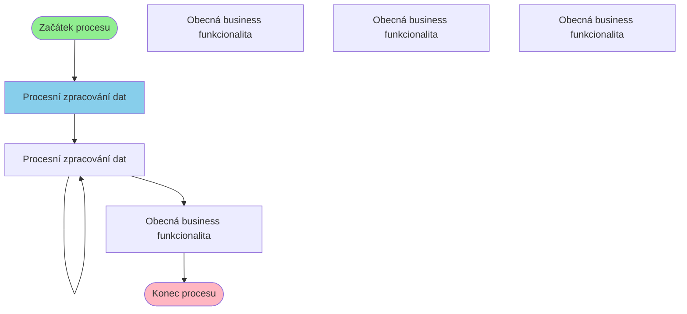

# Business proces: DokladyProcess

**Vstupní stránka:** DokladyProcess

## Přehled procesu

**Počet kroků:** 6
**Počet variant flow:** 4

## Procesní diagram

## Detailní analýza kroků

### Krok 1: DokladyProcess

**Soubor:** `/Users/radektuma/DEV/KIS/sources/JSP/DokladyProcess.jsp`

**Funkce v procesu:** Procesní zpracování dat

#### Volané Java metody

- `HtmlServices.getRequestParameters()`
- `Integer.parseInt()`
- `equals()`
- `getParameter()`
- `if()`

#### Business pravidla

- Import dat z externích zdrojů

---

### Krok 2: DokladyProcessGen

**Soubor:** `/Users/radektuma/DEV/KIS/sources/JSP/DokladyProcessGen.jsp`

**Funkce v procesu:** Procesní zpracování dat

#### Volané Java metody

- `HtmlServices.getRequestParameters()`
- `Integer.parseInt()`
- `getParameter()`

#### Business pravidla

- Import dat z externích zdrojů

---

### Krok 3: DokladyProcessGen

**Soubor:** `/Users/radektuma/DEV/KIS/sources/JSP/DokladyProcessGen.jsp`

**Funkce v procesu:** Procesní zpracování dat

#### Volané Java metody

- `HtmlServices.getRequestParameters()`
- `Integer.parseInt()`
- `getParameter()`

#### Business pravidla

- Import dat z externích zdrojů

---

### Krok 4: DokladyMan

**Soubor:** `/Users/radektuma/DEV/KIS/sources/JSP/DokladyMan.jsp`

**Funkce v procesu:** Obecná business funkcionalita

#### Volané Java metody

- `HtmlServices.getRequestParameters()`
- `Integer.parseInt()`
- `getParameter()`
- `getQueryString()`
- `getRequestURI()`

#### Business pravidla

- Kontrola oprávnění uživatele
- Import dat z externích zdrojů

---

## Alternativní procesní cesty

1. DokladyProcess → DokladyProcessGen → DokladyProcessGen → DokladyMan
2. DokladyProcess → DokladyProcessGen → DokladyProcessGen → DokladyManStarsi
3. DokladyProcess → DokladyProcessGen → DokladyProcessGen → Doklady
4. DokladyProcess → DokladyProcessGen → DokladyProcessGen → DokladySpol
