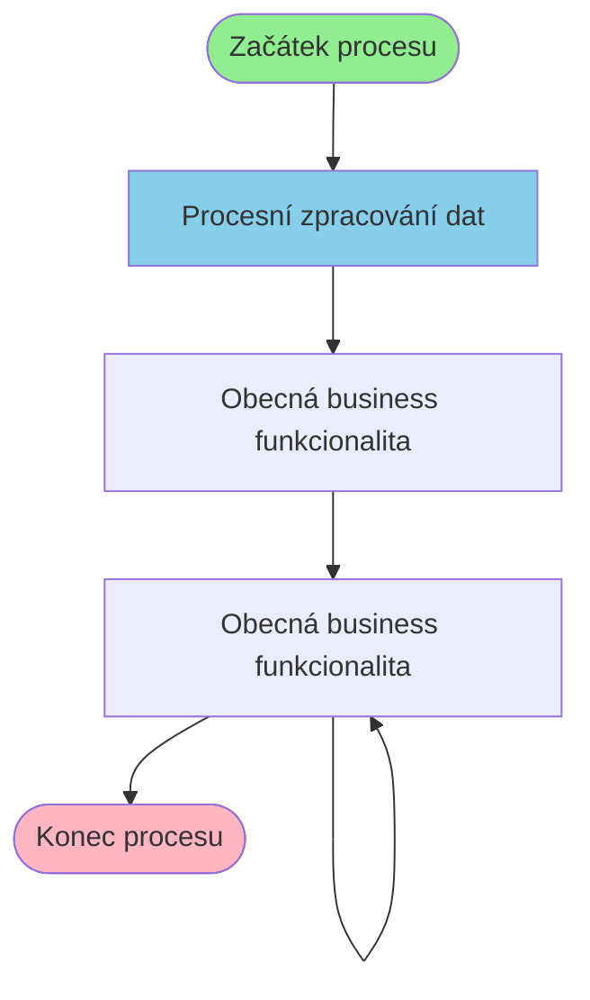

# Business proces: EviDodavatelProcess

**Vstupní stránka:** EviDodavatelProcess

## Přehled procesu

**Počet kroků:** 3
**Počet variant flow:** 1

## Procesní diagram

## Detailní analýza kroků

### Krok 1: EviDodavatelProcess

**Soubor:** `/Users/radektuma/DEV/KIS/sources/JSP/EviDodavatelProcess.jsp`

**Funkce v procesu:** Procesní zpracování dat

#### Volané Java metody

- `EviModule.useApplicationModule()`
- `HtmlServices.getRequestParameters()`
- `Integer.parseInt()`
- `equals()`
- `eviExtDodavatel()`

#### Business pravidla

- Import dat z externích zdrojů

---

### Krok 2: EviDodavatel

**Soubor:** `/Users/radektuma/DEV/KIS/sources/JSP/EviDodavatel.jsp`

**Funkce v procesu:** Obecná business funkcionalita

#### Volané Java metody

- `confirm()`
- `deleteIt()`
- `if()`
- `isUserInRole()`

#### Business pravidla

- Kontrola oprávnění uživatele
- Import dat z externích zdrojů

---

### Krok 3: SpolecnostPs

**Soubor:** `/Users/radektuma/DEV/KIS/sources/JSP/SpolecnostPs.jsp`

**Funkce v procesu:** Obecná business funkcionalita

#### Volané Java metody

- `HtmlServices.getRequestParameters()`
- `Param.length()`
- `close()`
- `getElementById()`
- `getParameter()`

#### Business pravidla

- Import dat z externích zdrojů

---

### Krok 4: SpolecnostPs

**Soubor:** `/Users/radektuma/DEV/KIS/sources/JSP/SpolecnostPs.jsp`

**Funkce v procesu:** Obecná business funkcionalita

#### Volané Java metody

- `HtmlServices.getRequestParameters()`
- `Param.length()`
- `close()`
- `getElementById()`
- `getParameter()`

#### Business pravidla

- Import dat z externích zdrojů

---

