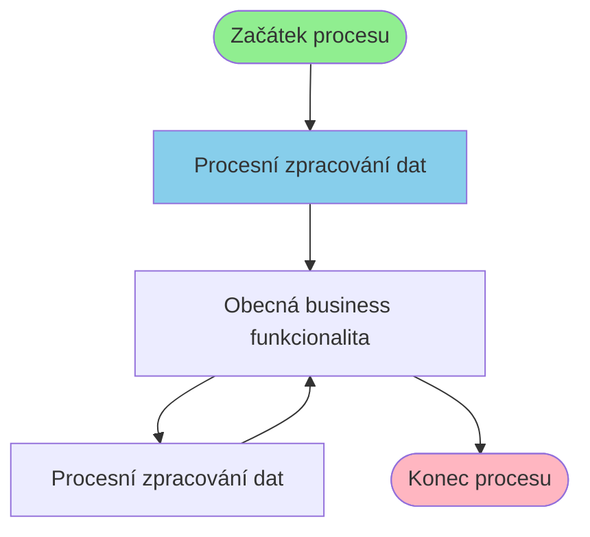

# Business proces: MazaniProcess

**Vstupní stránka:** MazaniProcess

## Přehled procesu

**Počet kroků:** 3
**Počet variant flow:** 1

## Procesní diagram

## Detailní analýza kroků

### Krok 1: MazaniProcess

**Soubor:** `/Users/radektuma/DEV/KIS/sources/JSP/MazaniProcess.jsp`

**Funkce v procesu:** Procesní zpracování dat

#### Volané Java metody

- `delete()`
- `equals()`
- `for()`
- `getAbsolutePath()`
- `getName()`

#### Business pravidla

- Import dat z externích zdrojů

---

### Krok 2: Mazani

**Soubor:** `/Users/radektuma/DEV/KIS/sources/JSP/Mazani.jsp`

**Funkce v procesu:** Obecná business funkcionalita

#### Volané Java metody

- `equals()`
- `for()`
- `getAbsolutePath()`
- `getName()`
- `if()`

#### Business pravidla

- Validace vstupních dat
- Import dat z externích zdrojů

---

### Krok 3: MazaniProcess2

**Soubor:** `/Users/radektuma/DEV/KIS/sources/JSP/MazaniProcess2.jsp`

**Funkce v procesu:** Procesní zpracování dat

#### Volané Java metody

- `delete()`
- `deleteFiles()`
- `equals()`
- `for()`
- `getAbsolutePath()`

#### Business pravidla

- Import dat z externích zdrojů

---

### Krok 4: Mazani

**Soubor:** `/Users/radektuma/DEV/KIS/sources/JSP/Mazani.jsp`

**Funkce v procesu:** Obecná business funkcionalita

#### Volané Java metody

- `equals()`
- `for()`
- `getAbsolutePath()`
- `getName()`
- `if()`

#### Business pravidla

- Validace vstupních dat
- Import dat z externích zdrojů

---

