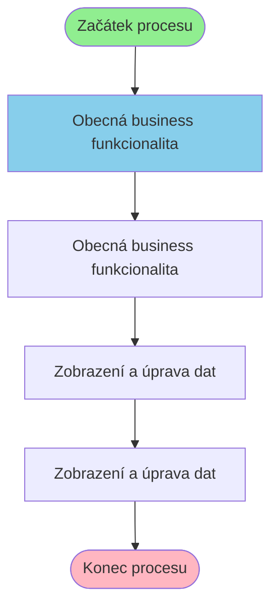

# Business proces: PbCis

**Vstupní stránka:** PbCis

## Přehled procesu

**Počet kroků:** 4
**Počet variant flow:** 1

## Procesní diagram

## Detailní analýza kroků

### Krok 1: PbCis

**Soubor:** `/Users/radektuma/DEV/KIS/sources/JSP/PbCis.jsp`

**Funkce v procesu:** Obecná business funkcionalita

#### Volané Java metody

- `Navigator.getInstance()`
- `reload()`
- `set()`

---

### Krok 2: PbCisSkupina

**Soubor:** `/Users/radektuma/DEV/KIS/sources/JSP/PbCisSkupina.jsp`

**Funkce v procesu:** Obecná business funkcionalita

#### Volané Java metody

- `deleteId()`
- `getElementById()`
- `submit()`
- `submitId()`

#### Business pravidla

- Import dat z externích zdrojů

---

### Krok 3: PbCisSkupinaEdit

**Soubor:** `/Users/radektuma/DEV/KIS/sources/JSP/PbCisSkupinaEdit.jsp`

**Funkce v procesu:** Zobrazení a úprava dat

#### Volané Java metody

- `HtmlServices.getRequestParameters()`
- `Integer.parseInt()`
- `getAttribute()`
- `getParameter()`
- `if()`

#### Business pravidla

- Import dat z externích zdrojů

---

### Krok 4: PbCisSkupinaEditProcess

**Soubor:** `/Users/radektuma/DEV/KIS/sources/JSP/PbCisSkupinaEditProcess.jsp`

**Funkce v procesu:** Zobrazení a úprava dat

#### Volané Java metody

- `HtmlServices.getRequestParameters()`
- `Integer.parseInt()`
- `PbModule.useApplicationModule()`
- `getParameter()`
- `skupina()`

#### Business pravidla

- Import dat z externích zdrojů

---

