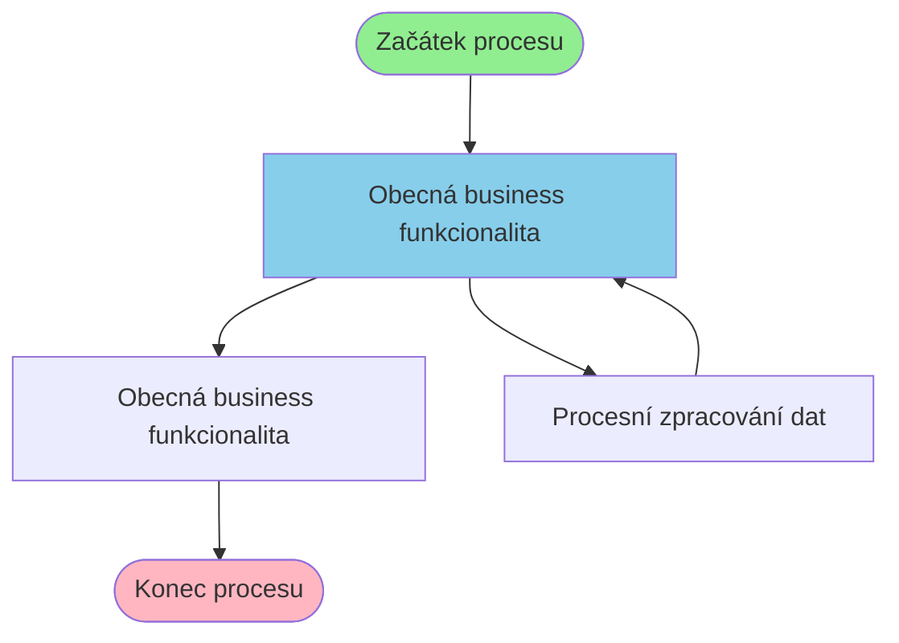

# Business proces: ProtiPoziceParovani

**Vstupní stránka:** ProtiPoziceParovani

## Přehled procesu

**Počet kroků:** 3
**Počet variant flow:** 1

## Procesní diagram

## Detailní analýza kroků

### Krok 1: ProtiPoziceParovani

**Soubor:** `/Users/radektuma/DEV/KIS/sources/JSP/ProtiPoziceParovani.jsp`

**Funkce v procesu:** Obecná business funkcionalita

#### Volané Java metody

- `HtmlServices.getRequestParameters()`
- `getParameter()`
- `indexOf()`
- `open()`
- `psWindow()`

#### Business pravidla

- Import dat z externích zdrojů

---

### Krok 2: ProtiPoziceParovaniProcess

**Soubor:** `/Users/radektuma/DEV/KIS/sources/JSP/ProtiPoziceParovaniProcess.jsp`

**Funkce v procesu:** Procesní zpracování dat

#### Volané Java metody

- `HtmlServices.getRequestParameters()`
- `Integer.parseInt()`
- `ProtistranyModule.useApplicationModule()`
- `for()`
- `getParameter()`

#### Business pravidla

- Import dat z externích zdrojů

---

### Krok 3: ProtiPoziceParovani

**Soubor:** `/Users/radektuma/DEV/KIS/sources/JSP/ProtiPoziceParovani.jsp`

**Funkce v procesu:** Obecná business funkcionalita

#### Volané Java metody

- `HtmlServices.getRequestParameters()`
- `getParameter()`
- `indexOf()`
- `open()`
- `psWindow()`

#### Business pravidla

- Import dat z externích zdrojů

---

### Krok 4: DokladyManDefPs

**Soubor:** `/Users/radektuma/DEV/KIS/sources/JSP/DokladyManDefPs.jsp`

**Funkce v procesu:** Obecná business funkcionalita

#### Volané Java metody

- `HtmlServices.getRequestParameters()`
- `Param.length()`
- `close()`
- `getElementById()`
- `getParameter()`

#### Business pravidla

- Import dat z externích zdrojů

---

