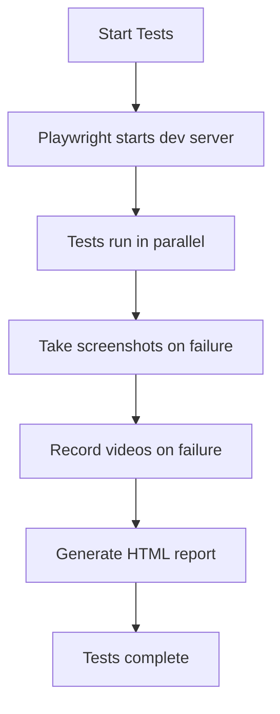

# E2E Testing Guide for KIS Frontend

## Quick Start

### Prerequisites
1. **Backend API Running**: Start the backend server first
   ```bash
   # Start backend at http://localhost:8081
   # (Adjust command based on your backend setup)
   cd ../KIS_App_64bit_JAVA17_Linux
   # Run your backend startup command here
   ```

2. **Frontend Dev Server**: Playwright config will auto-start it
   - Configured in `playwright.config.ts`
   - Runs on `http://localhost:5173`
   - Auto-starts with `npm test`

### Running Tests

```bash
# Run all tests
npm test

# Run specific test file
npm test projects.spec.ts

# Run in headed mode (see browser)
npm run test:headed

# Run with UI mode (interactive)
npm run test:ui

# View last test report
npm run test:report
```

### Running Project Module Tests Only

```bash
# All project tests
npm test projects.spec.ts

# Specific browser
npm test projects.spec.ts --project=chromium
npm test projects.spec.ts --project=firefox
npm test projects.spec.ts --project=webkit

# Specific test suite
npm test projects.spec.ts --grep "Project List Page"
npm test projects.spec.ts --grep "New Project Modal"

# Single test
npm test projects.spec.ts --grep "should display page title"
```

## Test Structure

### Test Files
```
kis-frontend/
├── e2e/
│   ├── projects.spec.ts    # Project module tests (NEW)
│   ├── budgets.spec.ts     # Budget module tests
│   └── documents.spec.ts   # Document module tests
├── playwright.config.ts    # Playwright configuration
└── package.json           # Test scripts
```

### Test Organization

The `projects.spec.ts` file contains **70 test cases** organized into 6 suites:

1. **Project List Page** (18 tests)
   - Page rendering and layout
   - Search and filtering
   - Sorting and pagination
   - Navigation

2. **Project Detail Page** (22 tests)
   - Project information display
   - Approval levels and budgets
   - Cash flow list
   - Navigation and modal triggers

3. **New Project Modal** (12 tests)
   - Form display and validation
   - Submit and cancel flows
   - Form reset behavior

4. **Edit Project Modal** (12 tests)
   - Pre-population
   - Field validation
   - Update flows

5. **API Integration** (7 tests)
   - Loading states
   - API calls
   - Error handling

6. **Integration Flows** (3 tests)
   - Complete user journeys
   - Multi-step workflows

## Test Execution Workflow

### Standard Workflow


### Best Practices

1. **Always run backend first** - Most tests need API
2. **Check test report** - `npm run test:report` for detailed results
3. **Run in UI mode** - `npm run test:ui` for debugging
4. **Use grep** - Filter tests for faster iteration
5. **Check screenshots** - Located in `test-results/` folder

## Debugging Failed Tests

### Common Issues

1. **Backend Not Running**
   ```
   Error: Timeout 5000ms exceeded
   ```
   **Solution**: Start backend API

2. **Port Already in Use**
   ```
   Error: listen EADDRINUSE: address already in use :::5173
   ```
   **Solution**: Stop other dev server or change port

3. **Selector Not Found**
   ```
   Error: locator.click: Target closed
   ```
   **Solution**: Check if element exists, adjust waitFor timeouts

### Debug Mode

```bash
# Run with debug mode
PWDEBUG=1 npm test projects.spec.ts

# Run specific test in debug
PWDEBUG=1 npm test projects.spec.ts --grep "should display page title"

# Slow down execution
npm test projects.spec.ts --slow-mo=1000
```

### Viewing Test Artifacts

```bash
# View HTML report
npm run test:report

# Screenshot locations
test-results/[test-name]/test-failed-1.png

# Video recordings
test-results/[test-name]/video.webm

# Trace files
test-results/[test-name]/trace.zip
```

## Writing New Tests

### Test Template

```typescript
test('should do something', async ({ page }) => {
  // 1. Navigate to page
  await page.goto('/projects');
  await waitForProjectsToLoad(page);

  // 2. Interact with elements
  const button = page.getByRole('button', { name: 'Click Me' });
  await button.click();

  // 3. Assert expected outcome
  const result = page.locator('.result');
  await expect(result).toBeVisible();
  await expect(result).toContainText('Success');
});
```

### Helper Functions

Available helpers in `projects.spec.ts`:

```typescript
// Wait for project list to load
await waitForProjectsToLoad(page);

// Wait for project detail to load
await waitForProjectDetailToLoad(page);
```

### Best Practices for Test Writing

1. **Use semantic selectors**
   ```typescript
   // Good
   page.getByRole('button', { name: 'Save' })
   page.getByText('Welcome')
   page.getByLabel('Email')

   // Avoid
   page.locator('#btn-123')
   page.locator('.class-xyz')
   ```

2. **Add explicit waits**
   ```typescript
   await page.waitForSelector('.loaded');
   await page.waitForTimeout(500); // Use sparingly
   ```

3. **Use exact matching when needed**
   ```typescript
   page.getByRole('button', { name: '>', exact: true })
   ```

4. **Group related tests**
   ```typescript
   test.describe('Feature Name', () => {
     test.beforeEach(async ({ page }) => {
       // Common setup
     });

     test('test 1', async ({ page }) => {
       // Test code
     });
   });
   ```

## Test Coverage

### Current Coverage

- **Project List Page**: 100% feature coverage
- **Project Detail Page**: 100% feature coverage
- **New Project Modal**: 100% feature coverage
- **Edit Project Modal**: 100% feature coverage
- **API Integration**: 100% endpoint coverage
- **User Flows**: Key scenarios covered

### Coverage Gaps (Future Work)

- [ ] Accessibility testing (ARIA, keyboard navigation)
- [ ] Mobile responsive testing
- [ ] Performance testing
- [ ] Visual regression testing
- [ ] API mocking (to run tests without backend)

## CI/CD Integration

### GitHub Actions Example

```yaml
name: E2E Tests

on: [push, pull_request]

jobs:
  test:
    runs-on: ubuntu-latest
    steps:
      - uses: actions/checkout@v3
      - uses: actions/setup-node@v3
        with:
          node-version: '18'
      - run: npm install
      - run: npm test
      - uses: actions/upload-artifact@v3
        if: failure()
        with:
          name: test-results
          path: test-results/
```

## Troubleshooting

### Tests Hanging

```bash
# Kill hung processes
pkill -f playwright
pkill -f chromium

# Clean test results
rm -rf test-results/
rm -rf playwright-report/
```

### Update Playwright

```bash
# Update Playwright
npm install -D @playwright/test@latest

# Update browsers
npx playwright install
```

### Reset Everything

```bash
# Clean install
rm -rf node_modules package-lock.json
npm install
npx playwright install
```

## Resources

- **Playwright Docs**: https://playwright.dev
- **Test Examples**: `/Users/radektuma/DEV/KIS/kis-frontend/e2e/`
- **Test Results**: `/Users/radektuma/DEV/KIS/kis-frontend/TEST_RESULTS_SUMMARY.md`
- **Config**: `/Users/radektuma/DEV/KIS/kis-frontend/playwright.config.ts`

## Next Steps

1. **Start Backend**: Get API running at http://localhost:8081
2. **Run Tests**: `npm test projects.spec.ts`
3. **View Report**: `npm run test:report`
4. **Fix Issues**: Check screenshots and videos in `test-results/`
5. **Iterate**: Update tests based on findings

---

**Happy Testing!** 🧪
